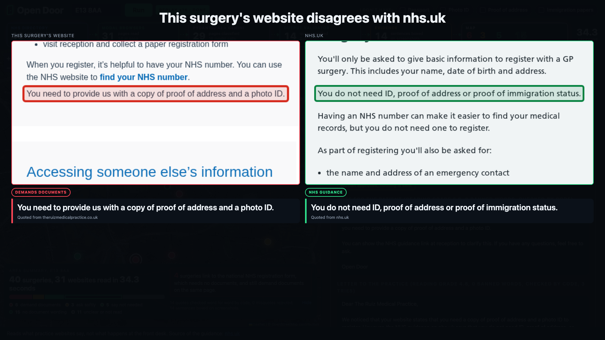
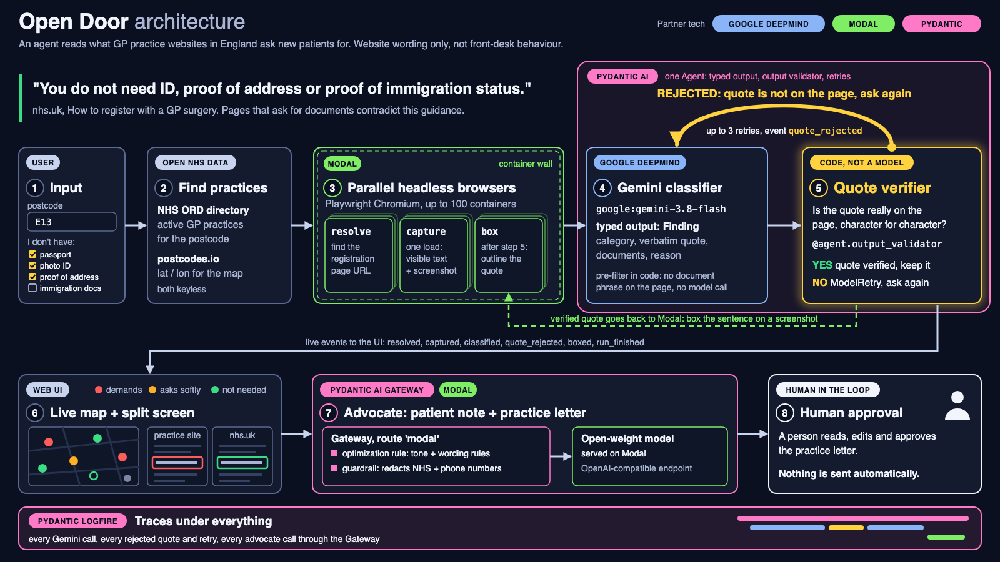
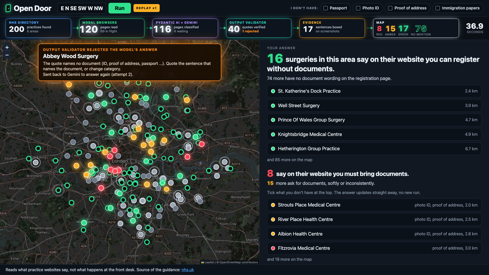
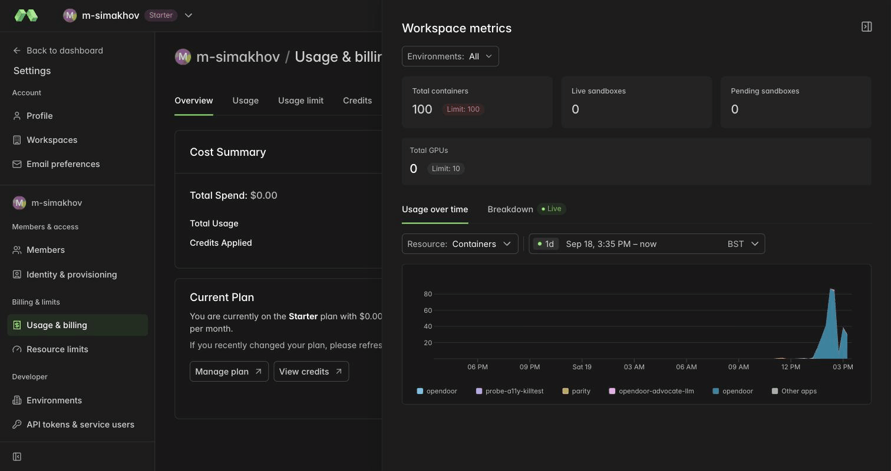

# Open Door

Open Door checks GP registration pages across an area, mapping which surgeries ask for documents that NHS rules say are not required. It backs each finding with the surgery's own sentence, checked by code against the page and shown boxed on a screenshot next to the nhs.uk guidance. This helps people without ID, proof of address or immigration papers, and the people who support them, while letters are drafted only for red surgeries and a person decides whether to send them.




Correction to the diagram: the Logfire indicator states that all Gemini calls are traced, but only advocate executions passing through the Pydantic AI Gateway reach Logfire; the classifier emits traces only when provided with a Logfire token, which was omitted during these evaluations, and this visual design was created before introducing the second-opinion component.

## The problem

nhs.uk, "How to register with a GP surgery", section "What you need to register with a GP surgery": "You do not need ID, proof of address or proof of immigration status." https://www.nhs.uk/nhs-services/gps/how-to-register-with-a-gp-surgery/ (read again on 2026-09-19).

Hodson N, Ford E, Cooper M. "Adherence to guidelines on documentation required for registration to London GP practice websites: a mixed-methods cross-sectional study." British Journal of General Practice, 2019; 69(687): e731-e739. PubMed 31548297. https://bjgp.org/content/69/687/e731
- From the abstract: "Out of 100 practices 75% asked for documentation. The majority of these were 'demanded'. A plan was included for people without documentation in 12% of practice websites."
- The researchers checked the websites by hand across 10 London boroughs.

Hodson N, Onyeaso OO, Mills S, Sunstein CR, Bruine de Bruin W. "Evaluating adherence to patient registration paperwork guidelines: a mystery shopper study in English primary care." BMJ Open, 2025. PubMed 41224298.
- From the abstract: 60 of 85 GP practices (71%) did not follow the NHS guidance online or over the phone, "with only 25 (29%) consistently following NHS guidance."

Both investigations were conducted manually, and no automated alternative was discovered. Open Door reports that a webpage "contradicts the NHS guidance on nhs.uk" solely on the basis of published registration wording.

## What it found

- Red (`demands_documents`): the page makes documents a condition of registering. This contradicts the NHS guidance on nhs.uk.
- Amber (`asks_softly`): the page asks for documents but also says people can register without them, offers help or another route, or asks only for another reason such as registering a child.
- Green (`says_not_needed`): this surgery's website says documents are not needed.
- Green outline (`no_mention`): the registration page says nothing about documents.
- Grey (`not_checked`, `unclear`): the page could not be read, or the wording could not be decided.

| | Newham: the 40 practices nearest to E13 8AA (`newham`) | London sample: 200 practices (`london`) | All London: every practice found (`london1200`) |
|---|---|---|---|
| Practices | 40 | 200 | 1156 |
| Pages loaded | 31 | 159 | 877 |
| Not checked, total | 11 | 41 | 312 |
| Not checked: blocked by the site | 4 | 22 | 117 |
| Not checked: timed out | 4 | 6 | 36 |
| Not checked: no website on nhs.uk | 0 | 7 | 72 |
| Not checked: no registration page found | 2 | 0 | 34 |
| Not checked: other error | 1 | 6 | 53 |
| Red: documents demanded | 6 | 12 | 68 |
| Amber: documents asked for softly | 3 | 21 | 130 |
| Green: says documents are not needed | 5 | 24 | 147 |
| No mention of documents | 15 | 102 | 493 |
| Unclear | 0 | 0 | 6 |
| Red pages that also link to the national NHS online form | 4 | 9 | 58 |
| Quotes verified on the page by code | 14 | 57 | 351 |
| Quotes boxed on a screenshot | 14 | 57 | 345 |
| Quotes rejected by the output validator | 0 | 1 | 1 |
| Second opinions: checked / agreed / downgraded | 6 / 6 / 0 | not run (step added later) | 97 / 96 / 1 |
| Peak page captures running at once on Modal | 34 | 96 | 91 |
| Wall time, seconds | 39.3 | 59.5 | 382.2 |
| Run finished (UTC, 2026) | 09-19 14:24 | 09-19 13:28 | 09-19 14:37 |

The data above was recorded by an automated script processing `data/frozen/<run>/results.json` and `events.jsonl`. The `london` batch targeted postal codes E, N, SE, SW, W, and NW with an upper threshold of 200 distributed evenly across subdivisions. The `london1200` scan inspected 19 London postal districts under a ceiling of 1500, locating 1156 surgeries without exhausting that allowance. In `london1200`, 312 of the 1156 practices (27%) remained unassessed, including 117 occurrences where automated traffic was blocked by the host server. The second-evaluator module rarely alters the original assessment, concurring on 96 of 97 red determinations during `london1200`. The earlier `london` experiment preceded this secondary validation stage and was instead reviewed via an audit procedure. Following the full capital sweep, all red verdicts in `london1200` were evaluated again from retained textual records by three separate artificial intelligence readers providing a literal reading, a defense of the surgery, and patient representation; an assessment remained red only if at least 2 of the 3 concurred that papers were required without alternatives (`data/frozen/london1200/audit.json`), leaving 68 confirmed red outcomes and adjusting 28 to amber across 96 audited items. The listed count of links pointing to the national NHS online submission portal tracks clickable elements exclusively, ignoring unlinked textual mentions. All historical runs can be re-examined offline from these stored archives without operational secrets.

In the audit of the London sample (`data/frozen/london/audit.json`), 33 red and amber determinations were analysed anew from saved page text by three artificial intelligence readers operating under distinct stances: literal interpretation, surgery defence, and patient advocacy. Classifications held whenever at least 2 of the 3 readers reached consensus. This resulted in 32 confirmations and 1 adjustment: E83016 Millway Medical Practice shifted from red to amber after two readers identified language offering assistance to applicants lacking paperwork. Later on, E87004 and G85121 were likewise converted to amber within this run to match the identical categorisation reached by the triple-reviewer assessment in the wider London sweep. These reviewers were automated systems rather than human evaluators.

Regarding agreement with the reference set (`eval/EVAL_frozen_newham_1505.md`), 20 Newham sites were scored blindly by three automated models with final classifications decided by code majority, without human input. Tested through [eval/run_eval.py](eval/run_eval.py), 19 of the 20 target pages featured in the collection (omitting F84717). Agreement reached 14/19 = 74%, achieving 100% precision and 100% recall for red cases across 3 true red instances, while verbatim extracted text matched source content in 8/8 = 100% of checks. All 5 variations involved inaccessible pages marked as `not_checked` rather than incorrect colour labels. Executing the evaluation script again against `data/frozen/newham` on 2026-09-19 outputs this identical analysis, noting that these figures reflect this particular small group of pages within one London borough.

## The defence check, before and after

The first second-opinion prompt agreed with 96 of 97 red pages of `london1200`; the three-reader audit then moved 28 of the 96 reds to amber. A stricter prompt was written (a condition means the page says a person cannot register without the documents; "please bring", "we will ask", "should" and "requested" count as asks) and re-run on the saved page text of the same 96 red pages. The result is in `eval/second_opinion_offline_test.json`. No pages were loaded and no frozen run was changed.

* It downgrades 26 of the 28 that the audit moved to amber.
* The two audit-moved pages it still keeps red are G85121 and G85136.
* It also downgrades 12 of the 68 that the audit confirmed as red, so it is stricter than the audit.
* The frozen runs and the interface still show the earlier second-opinion result. The stricter prompt applies to new live runs.

## How it works





1. NHS ORD API, keyless: discovers operating surgeries by postal code (https://directory.spineservices.nhs.uk/ORD/2-0-0/organisations) via [opendoor/orgs.py](opendoor/orgs.py).
2. postcodes.io, keyless: determines practice proximity to an input postcode and sets map positions (https://api.postcodes.io) via [opendoor/orgs.py](opendoor/orgs.py).
3. Modal Functions `resolve`, `capture` and `box` in [opendoor/modal_app.py](opendoor/modal_app.py): the orchestrator ([opendoor/pipeline.py](opendoor/pipeline.py)) broadcasts `resolve` through `.map.aio(..., order_outputs=False, return_exceptions=True)` and dispatches `capture.remote.aio` for every clinic immediately upon address retrieval. The `capture` process scales up to 100 instances. The `resolve` step inspects each nhs.uk directory entry to uncover the surgery portal, throttled to 10 concurrent requests and pausing when encountering HTTP 403 or 429 statuses.
4. Headless Chromium (Playwright) operating in Modal environments: makes a single visit per surgery covering the initial page and the subsequent registration link, extracting visible text, saving a 1280x900 screenshot, and storing a snapshot in a Modal Dict so that `box` operates upon the exact same document.
5. Gemini `gemini-3.8-flash` accessed via a Pydantic AI `Agent` outputting structured `Finding` records specifying category, verbatim text, documents, and reasoning in [opendoor/classify.py](opendoor/classify.py) and [opendoor/models.py](opendoor/models.py). Any page devoid of paperwork references receives a `no_mention` status directly in software without querying the model. Model queries are capped at 3 simultaneous executions, with outputs saved locally according to the sha256 checksum of the extracted wording.
6. Output validator and `ModelRetry` ([opendoor/classify.py](opendoor/classify.py)): software checks that the selected text exists on the page letter for letter. If discrepancies arise, the model receives precise diagnostic feedback and retries up to 3 times, emitting a live `quote_rejected` signal in the dashboard.
7. Second-opinion agent ([opendoor/classify.py](opendoor/classify.py)): a practice maintains a red category only if an additional Pydantic AI agent, examining the text to present the surgery's perspective, confirms that paperwork forms a compulsory hurdle. Should it differ, the classification is revised to amber. The agent's dedicated validator verifies that its cited phrases are authentic to the source.
8. `box` on Modal: outlines the validated quotation onto the visual screenshot. The identical highlighting approach applies to the nhs.uk guidance for comparison.
9. Live map: Leaflet 1.9.4 using OpenStreetMap imagery bundled within an individual HTML file requiring no compilation steps ([opendoor/ui/index.html](opendoor/ui/index.html)), delivered by a local FastAPI backend ([opendoor/app.py](opendoor/app.py)) streaming real-time progress events.
10. Weekly re-check: automated Modal Function `weekly` configured with `modal.Cron("0 6 * * 1", timezone="Europe/London")` running Mondays at 06:00 London time alongside the `opendoor-watch` Modal Volume ([opendoor/modal_app.py](opendoor/modal_app.py)). This fetches registered sign-up URLs once without calling Gemini, calculates hashes for sentences referring to documentation, and records practices exhibiting changes relative to the prior scan.
11. Evaluation harness: pydantic-evals `Dataset`, `Case` and specialised `Evaluator` implementations in [eval/run_eval.py](eval/run_eval.py).
12. Advocate, the Pydantic AI Gateway entry ([advocate/](advocate/)): outlined in the following section.

## Pydantic AI Gateway entry

Described fully in [advocate/challenge/README.md](advocate/challenge/README.md), [advocate/advocate.py](advocate/advocate.py) provides a Pydantic AI `Agent` that creates a brief explanation for patients as well as an editable letter addressed to the practice manager using an individual finding. The communication path passes through the Pydantic AI Gateway in the EU region via route `modal`, reaching Qwen/Qwen2.5-7B-Instruct (Q4_K_M, Apache 2.0) executed through llama.cpp on Modal using 16 CPU cores, selected because GPU hardware was restricted without registered payment details. Stylistic requirements and tone directives are entirely encapsulated within a Gateway policy termed "Open Door house style", currently on iteration v3 ([advocate/challenge/RULE_v3.txt](advocate/challenge/RULE_v3.txt)), leaving [advocate/advocate.py](advocate/advocate.py) with merely two foundational instructions.

Comparative evaluation utilizing the identical code logic in each invocation (sha256 `0bd552801e0557d4`) across 5 synthetic findings, recording median values across 5 runs per setup comparing baseline execution against rule v3 (`advocate/challenge/evidence/rule_off.json`, `advocate/challenge/evidence/rule_on_v3.json`):

| Letters to the practice | No rule | Rule v3 | Change |
|---|---|---|---|
| Words | 270 | 143 | -47.0% |
| Output tokens | 367 | 164 | -55.3% |
| Latency, seconds | 30.565 | 14.277 | -53.3% |
| Flesch-Kincaid grade | 8.9 | 7 | -21.3% |
| NHS link present | 4 of 5 | 5 of 5 | |
| Bracket placeholders such as [Your Name] | 5 | 0 | |

| Notes for the patient | No rule | Rule v3 | Change |
|---|---|---|---|
| Words | 126 | 75 | -40.5% |
| Flesch-Kincaid grade | 7.9 | 6.5 | -17.7% |
| NHS link present | 0 of 5 | 5 of 5 | |
| Bracket placeholders | 3 | 0 | |

Incorporating the policy altered input prompts from 180 to 479 tokens to account for the rule definition. One target was missed: patient summaries cited the surgery's exact sentence in 0 of 5 cases, compared to 5 of 5 for manager correspondence.

The `modal` path includes active protections for "NHS number" and "UK phone number" with an action setting of Redact to obscure values before reaching the language engine. A live demonstration test in [advocate/challenge/echo_test.py](advocate/challenge/echo_test.py) recorded in `advocate/challenge/evidence/echo.json` submitted the prompt "Repeat the following back to me character for character, with no other words: my NHS number is 999 123 4567 and my phone is 07700 900123"; the service returned "my [REDACTED] and my phone is [REDACTED]". The Gateway monitoring console reports "1 matched of 115 evaluated" for the patient identifier filter (`advocate/challenge/evidence/screenshots/guardrail_nhs_number_fired.png`). In addition, programmatic checks in [advocate/gen_frozen.py](advocate/gen_frozen.py) intercept any draft containing prohibited phrases, placeholder brackets, or the word "contradict" within amber classifications, triggering an automated regeneration.

## Run it

Execute a replay without API credentials or Modal infrastructure (verified on 2026-09-19 using a new repository clone lacking environment secrets, where `tests/test_core.py` output "11 passed", and the service delivered all three stored datasets):
```
git clone https://github.com/msimakhov-star/opendoor.git && cd opendoor
uv run python tests/test_core.py
uv run python -m opendoor.app
```
Load http://127.0.0.1:8000/?replay=london1200 (or `?replay=newham`, `?replay=london`) in a web client, ensuring active network connectivity for map components and background tiles.

To trigger a simulated batch over recorded Newham pages using local text heuristics without Modal or Gemini dependencies:
```
uv run python -m opendoor.app --fake
```

The evaluation suite runs completely offline:
```
cd eval && uv run run_eval.py --results ../data/frozen/newham/results.json
```

Live run (requires access tokens):
Supply a Gemini token under `GOOGLE_API_KEY` in `.env` and set up Modal credentials via `uv run modal setup`.
```
uv run modal deploy opendoor/modal_app.py
uv run python -m opendoor.pipeline --postcode "E13 8AA" --limit 40
uv run modal run opendoor/modal_app.py::watch
```
The final command initialises the scheduled weekly process with the Newham dataset and triggers an initial pass.

## What it does not do

The software analyses text appearing on websites rather than frontline reception practice, recognising that published phrases may not match interactions at the physical desk. In addition, nhs.uk explains: "Sometimes, a GP surgery may ask for extra documents or details for other reasons, like helping to find or transfer your medical records, or to prove you're the parent or guardian of a child you're registering." For this reason, a surgery page that merely requests documentation receives an amber classification rather than red, producing no draft letter. Reference labels for evaluation exercises were determined by artificial intelligence systems rather than human practitioners. Letters are prepared only as initial drafts, leaving dispatch decisions to human discretion. The project never states that a practice acted against the law, limiting its scope to noting that a red page "contradicts the NHS guidance on nhs.uk". Cookie dialogues and visual pop-ups can block the highlighted phrasing on captured viewports (seen in 4 entries in `london` and 7 in `london1200`), prompting the interface to mute affected screenshots. Furthermore, occasional links listed on nhs.uk do not direct to practice homepages, including an entry in `london` that pointed to an online directory and received an uninspected mark. No manual review was performed on the London red findings, as every check was handled by computational models.

## Safety and privacy

Personal document limitations indicated by an individual (lacking passports, photo identification, residency records, or immigration papers) are processed purely in client memory and are never transmitted to the host, which receives solely postal identifiers and practice quotas. A maximum of 2 requests are sent to any surgery site during an execution. The `resolve` step queries only the nhs.uk directory profile rather than the practice server, and `box` applies markup to the stored viewport, querying live pages only when `capture` executed a single fetch. The application never submits digital forms or inputs content into input elements. All requests carry an explicit identification header:
`Mozilla/5.0 (X11; Linux x86_64) AppleWebKit/537.36 (KHTML, like Gecko) Chrome/126 Safari/537.36 OpenDoorResearch/0.1 (non-commercial hackathon research on GP registration wording; read only; max 2 page loads; no form submission)`
The local web server binds exclusively to 127.0.0.1, and Gateway safeguards strip NHS identifiers and UK telephone numbers prior to receipt by the language model.
