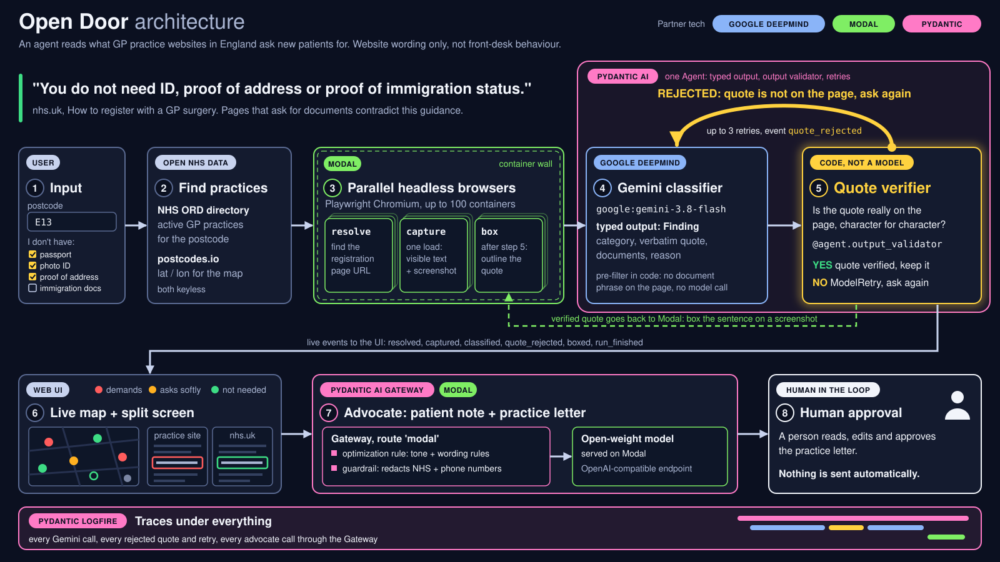

## Architecture

According to nhs.uk: "You do not need ID, proof of address or proof of immigration status." Open Door inspects the actual text on GP practice websites. It evaluates published online wording rather than reception staff actions.

1. **Input.** Users provide a postcode (such as E13) and tick which items they lack (passport, photo ID, proof of address, immigration documents). Deterministic code compares these selections against verified quotes from each surgery. The patient display then indicates the number of local clinics stating online that registration is possible without these papers.
2. **Find practices (open NHS data).** The system queries the NHS ORD directory to find functioning GP clinics around the postcode. Coordinates for mapping come from postcodes.io. Neither API requires an API key.
3. **Parallel headless browsers (Modal).** Three Modal functions do the web work, so the local machine never loads hundreds of webpages itself:
   - `resolve` makes one request to the practice's nhs.uk profile to get its homepage. No browser, and no request to the practice site.
   - `capture` runs Playwright Chromium: it loads the homepage and then its registration link, at most 2 loads per practice, to extract visible text and capture a screenshot (up to 100 containers at once, with results streamed back).
   - `box` executes solely after step 5 to locate the verified quote and draw a border round that sentence on the captured image. It runs once against nhs.uk to create the baseline comparison screenshot.
4. **Gemini classifier (Google DeepMind, through Pydantic AI).** A Pydantic AI `Agent` using `google:gemini-3.8-flash` produces structured output as a `Finding`, containing the classification, exact quote, relevant documents and rationale. Standard code filters out pages lacking document terminology before invoking the model.
5. **Quote verifier (code, not a model).** A Pydantic AI `output_validator` confirms the excerpt appears verbatim in the source text once spacing is normalised. If the match fails, the script triggers `ModelRetry`, logs a `quote_rejected` event, and prompts Gemini again (permitting up to 3 retries). The pipeline retains only confirmed text and passes it to `box`. Before a surgery stays red, a second Gemini reader argues the surgery's side on the same passages; unless it also finds a firm requirement with no way in for people without documents, the surgery is shown amber (`second_opinion` event).
6. **Live map and split screen (web UI).** Real-time progress updates stream directly to the interface (`resolved`, `captured`, `classified`, `quote_rejected`, `second_opinion`, `boxed`, `run_finished`). Surgeries are plotted using colour markers: red for mandatory document demands, amber for optional requests, and green where documents are stated as unnecessary. A side-by-side view displays the highlighted sentence from the clinic website alongside the corresponding extract from nhs.uk.
7. **Advocate (Pydantic AI Gateway plus Modal).** An open-weights model hosted on Modal receives requests from a Pydantic AI agent via the Pydantic AI Gateway on route `modal` (an OpenAI-compatible endpoint). It drafts a guidance summary for the patient, along with a formal letter addressed to the practice when classified as red. Amber sites merely request documents without conflicting with guidance on nhs.uk, so the interface shows no letter for them. (The frozen Newham `advocate.json` still holds letters generated for 3 amber practices before that decision; the interface does not show them.) The application keeps instructions compact because reading accessibility, tone, and phrasing guidelines reside in a Gateway optimization rule. An inbound Gateway guardrail automatically sanitises NHS numbers and telephone numbers.
8. **Human approval.** A human reviewer inspects, modifies, and authorises any generated letter for red surgeries before dispatch. The platform never sends correspondence autonomously.

**Observability: Pydantic Logfire.** Gateway telemetry transmits each advocate call passing through the Pydantic AI Gateway into Logfire.

Partner tech by stage: Google DeepMind (4), Modal (3 and the model in 7), Pydantic (Pydantic AI in 4 and 5, the Gateway in 7, Logfire for Gateway calls in 7).
